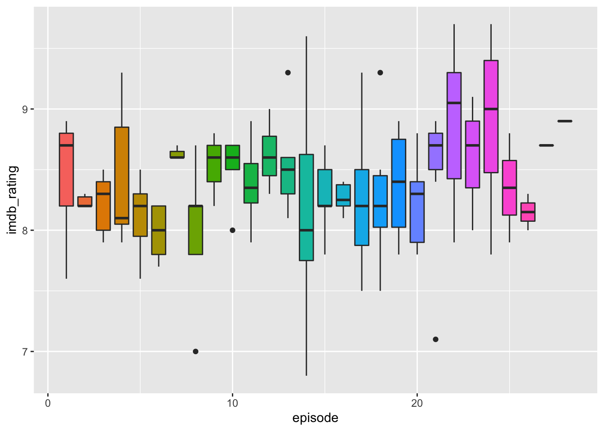
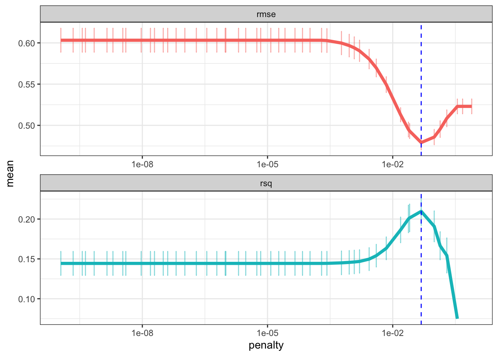
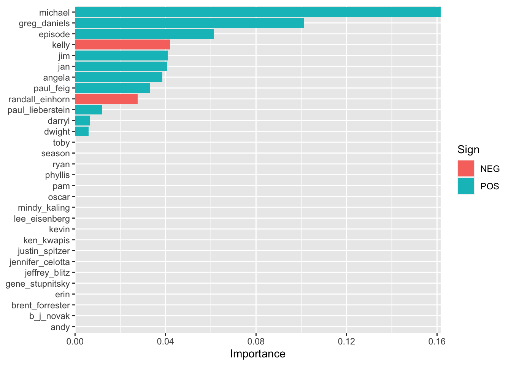
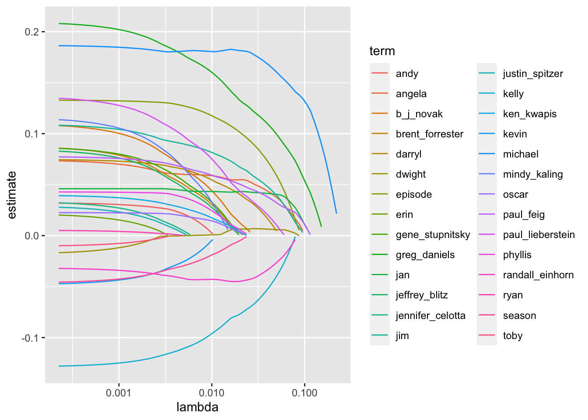
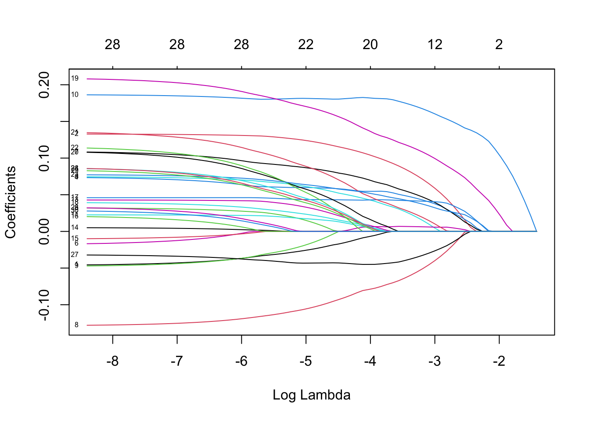
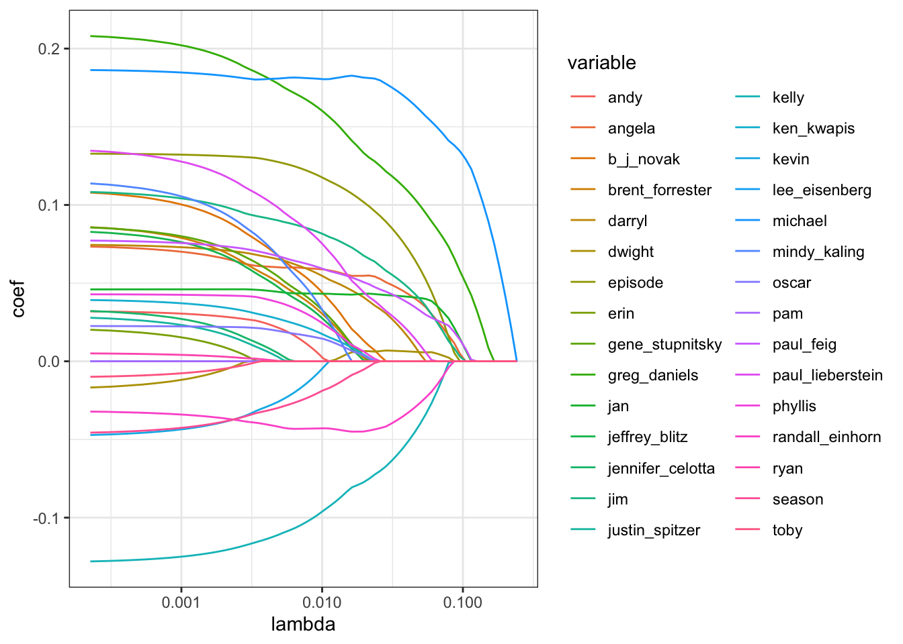

# glmnet

## 理論  

## lasso 實作  

* 這篇文章摘自 Julia Silge 在 2020/5/17 寫的 blog [連結](https://juliasilge.com/blog/lasso-the-office/)  
* 主要目的，是用 lasso regression，去預測 `The Office` 這個美國暢銷影集的某集 IMDB ratings  


```r
library(tidyverse)
```

### Explore the data  


```r
# ratings_raw <- readr::read_csv("https://raw.githubusercontent.com/rfordatascience/tidytuesday/master/data/2020/2020-03-17/office_ratings.csv")
# 
# remove_regex = "[:punct:]|[:digit:]|parts |part |the |and"
# 
# office_ratings <- ratings_raw %>%
#   transmute(
#     episode_name = str_to_lower(title),
#     episode_name = str_remove_all(
#       episode_name, remove_regex
#     ),
#     episode_name = str_trim(episode_name),
#     imdb_rating
#   )
# 
# office_info <- schrute::theoffice %>%
#   mutate(
#     season = as.numeric(season),
#     episode = as.numeric(episode),
#     episode_name = str_to_lower(episode_name),
#     episode_name = str_remove_all(episode_name, remove_regex),
#     episode_name = str_trim(episode_name)
#   ) %>%
#   select(season, episode, episode_name, director, writer, character)
# 
# characters <- office_info %>%
#   count(episode_name, character) %>%
#   add_count(character, wt = n, name = "character_count") %>%
#   filter(character_count > 800) %>%
#   select(-character_count) %>%
#   pivot_wider(
#     names_from = character,
#     values_from = n,
#     values_fill = list(n = 0)
#   )
# 
# creators <- office_info %>%
#   distinct(episode_name, director, writer) %>%
#   pivot_longer(director:writer, names_to = "role", values_to = "person") %>%
#   separate_rows(person, sep = ";") %>%
#   add_count(person) %>%
#   filter(n > 10) %>%
#   distinct(episode_name, person) %>%
#   mutate(person_value = 1) %>%
#   pivot_wider(
#     names_from = person,
#     values_from = person_value,
#     values_fill = list(person_value = 0)
#   )
# 
# office <- office_info %>%
#   distinct(season, episode, episode_name) %>%
#   inner_join(characters) %>%
#   inner_join(creators) %>%
#   inner_join(office_ratings %>%
#     select(episode_name, imdb_rating)) %>%
#   janitor::clean_names()
# 
# saveRDS(office, "model_example/glmnet/office.rds")
office = readRDS("./data/office.rds")
office
#> # A tibble: 136 × 32
#>    season episode episode_name     andy angela darryl dwight
#>     <dbl>   <dbl> <chr>           <int>  <int>  <int>  <int>
#>  1      1       1 pilot               0      1      0     29
#>  2      1       2 diversity day       0      4      0     17
#>  3      1       3 health care         0      5      0     62
#>  4      1       5 basketball          0      3     15     25
#>  5      1       6 hot girl            0      3      0     28
#>  6      2       1 dundies             0      1      1     32
#>  7      2       2 sexual harassm…     0      2      9     11
#>  8      2       3 office olympics     0      6      0     55
#>  9      2       4 fire                0     17      0     65
#> 10      2       5 halloween           0     13      0     33
#> # … with 126 more rows, and 25 more variables: jim <int>,
#> #   kelly <int>, kevin <int>, michael <int>, oscar <int>,
#> #   pam <int>, phyllis <int>, ryan <int>, toby <int>,
#> #   erin <int>, jan <int>, ken_kwapis <dbl>,
#> #   greg_daniels <dbl>, b_j_novak <dbl>,
#> #   paul_lieberstein <dbl>, mindy_kaling <dbl>,
#> #   paul_feig <dbl>, gene_stupnitsky <dbl>, …
```

* 要拿來預測用的資料，n = 135, p = 32  
* 變數說明：  
  * imdb_rating: 要預測的目標 y (連續型)  
  * episode_name 是 ID 欄位
  * season 有被我當 predictor，因為我猜不同季的 rating會不同(例如一開始rating還好，到中間口碑變很好所以rating高，到最後幾季又開始拖戲和爛尾所以 rating 低)
  * episode 也有被我當 predictor, 因為我猜不同 episode 的 rating 可能也不同 (例如每季剛開播，跟接近結束，可能 rating 較高，中間 rating 較低)  
  * andy, angela, ..., justin_spitzer 共 28 個變數，都是人名，裡面的數值，表示該演員在這一集裡面，講過多少次話。這些也被我當 predictor，我猜有些演員很討喜，他講越多話 rating 可能越好。  
* 整體看一下，有沒有 missing，以及分佈的狀況：  


```r
skimr::skim(office)
```


Table: (\#tab:unnamed-chunk-3)Data summary

|                         |       |
|:------------------------|:------|
|Name                     |office |
|Number of rows           |136    |
|Number of columns        |32     |
|_______________________  |       |
|Column type frequency:   |       |
|character                |1      |
|numeric                  |31     |
|________________________ |       |
|Group variables          |None   |


**Variable type: character**

|skim_variable | n_missing| complete_rate| min| max| empty| n_unique| whitespace|
|:-------------|---------:|-------------:|---:|---:|-----:|--------:|----------:|
|episode_name  |         0|             1|   3|  31|     0|      132|          0|


**Variable type: numeric**

|skim_variable    | n_missing| complete_rate|  mean|    sd|  p0|   p25|  p50|   p75|  p100|hist       |
|:----------------|---------:|-------------:|-----:|-----:|---:|-----:|----:|-----:|-----:|:----------|
|season           |         0|             1|  4.85|  2.20| 1.0|  3.00|  5.0|  6.00|   9.0|▆▇▅▇▃ |
|episode          |         0|             1| 12.66|  7.52| 1.0|  5.75| 13.0| 19.00|  28.0|▇▅▇▆▂ |
|andy             |         0|             1| 18.10| 18.20| 0.0|  2.75| 13.5| 28.00|  75.0|▇▃▂▁▁ |
|angela           |         0|             1|  8.85|  9.77| 0.0|  3.00|  5.0| 12.00|  52.0|▇▂▁▁▁ |
|darryl           |         0|             1|  4.62|  7.59| 0.0|  0.00|  0.0|  7.25|  43.0|▇▂▁▁▁ |
|dwight           |         0|             1| 36.49| 19.14| 4.0| 22.00| 32.5| 49.00|  87.0|▅▇▃▂▂ |
|jim              |         0|             1| 35.07| 18.10| 0.0| 22.00| 31.0| 44.25|  91.0|▂▇▃▂▁ |
|kelly            |         0|             1|  5.22|  5.85| 0.0|  1.00|  3.0|  8.00|  28.0|▇▂▁▁▁ |
|kevin            |         0|             1|  8.78|  6.67| 0.0|  4.00|  7.0| 13.00|  31.0|▇▅▃▁▁ |
|michael          |         0|             1| 70.37| 37.67| 0.0| 51.75| 76.5| 95.00| 159.0|▃▃▇▃▁ |
|oscar            |         0|             1|  7.62|  7.12| 0.0|  2.00|  6.0| 11.00|  38.0|▇▃▁▁▁ |
|pam              |         0|             1| 27.42| 17.17| 0.0| 16.00| 25.0| 33.00|  81.0|▅▇▃▁▁ |
|phyllis          |         0|             1|  5.46|  5.32| 0.0|  2.00|  4.0|  7.00|  27.0|▇▂▁▁▁ |
|ryan             |         0|             1|  6.16|  8.47| 0.0|  1.00|  4.0|  8.00|  60.0|▇▁▁▁▁ |
|toby             |         0|             1|  4.69|  7.26| 0.0|  0.00|  2.0|  7.00|  37.0|▇▁▁▁▁ |
|erin             |         0|             1|  5.35|  9.06| 0.0|  0.00|  0.0|  9.00|  52.0|▇▁▁▁▁ |
|jan              |         0|             1|  5.04| 12.68| 0.0|  0.00|  0.0|  0.00|  73.0|▇▁▁▁▁ |
|ken_kwapis       |         0|             1|  0.10|  0.31| 0.0|  0.00|  0.0|  0.00|   1.0|▇▁▁▁▁ |
|greg_daniels     |         0|             1|  0.17|  0.38| 0.0|  0.00|  0.0|  0.00|   1.0|▇▁▁▁▂ |
|b_j_novak        |         0|             1|  0.13|  0.34| 0.0|  0.00|  0.0|  0.00|   1.0|▇▁▁▁▁ |
|paul_lieberstein |         0|             1|  0.13|  0.34| 0.0|  0.00|  0.0|  0.00|   1.0|▇▁▁▁▁ |
|mindy_kaling     |         0|             1|  0.18|  0.39| 0.0|  0.00|  0.0|  0.00|   1.0|▇▁▁▁▂ |
|paul_feig        |         0|             1|  0.10|  0.31| 0.0|  0.00|  0.0|  0.00|   1.0|▇▁▁▁▁ |
|gene_stupnitsky  |         0|             1|  0.11|  0.31| 0.0|  0.00|  0.0|  0.00|   1.0|▇▁▁▁▁ |
|lee_eisenberg    |         0|             1|  0.11|  0.31| 0.0|  0.00|  0.0|  0.00|   1.0|▇▁▁▁▁ |
|jennifer_celotta |         0|             1|  0.09|  0.28| 0.0|  0.00|  0.0|  0.00|   1.0|▇▁▁▁▁ |
|randall_einhorn  |         0|             1|  0.11|  0.31| 0.0|  0.00|  0.0|  0.00|   1.0|▇▁▁▁▁ |
|brent_forrester  |         0|             1|  0.10|  0.31| 0.0|  0.00|  0.0|  0.00|   1.0|▇▁▁▁▁ |
|jeffrey_blitz    |         0|             1|  0.08|  0.27| 0.0|  0.00|  0.0|  0.00|   1.0|▇▁▁▁▁ |
|justin_spitzer   |         0|             1|  0.08|  0.27| 0.0|  0.00|  0.0|  0.00|   1.0|▇▁▁▁▁ |
|imdb_rating      |         0|             1|  8.37|  0.51| 6.8|  8.10|  8.3|  8.70|   9.7|▁▃▇▅▂ |
* 全部欄位都沒有 missing， y 的分佈蠻不錯的常態  
* 這邊再做一個 EDA ，看看 episode 和 rating有沒有關係 (是不是每一季越到後面的集數，rating會越高？)  


```r
office %>%
  ggplot(aes(episode, imdb_rating, fill = as.factor(episode))) +
  geom_boxplot(show.legend = FALSE)
```



* 看起來的確有這個趨勢啊！  

### Train a model  

#### split data  


```r
library(rsample)
set.seed(1234)
office_split <- initial_split(office, strata = season)
office_train <- training(office_split)
office_test <- testing(office_split)

# 資料太少，不用 cv ，改用 bootstrap
set.seed(1234)
office_boot <- bootstraps(office_train, strata = season)
```

#### preprocessing  


```r
library(recipes)
office_rec <- recipe(imdb_rating ~ ., data = office_train) %>%
  update_role(episode_name, new_role = "ID") %>% # episode 不把他當 predictor
  step_zv(all_numeric(), -all_outcomes()) %>% # zero variance 對 回歸問題都會造成影響
  step_normalize(all_numeric(), -all_outcomes()) # lasso 需要做 normalize
```
 
#### specify model  


```r
library(parsnip)
library(tune)
lasso_spec <- linear_reg(penalty = tune(), mixture = 1) %>%
  set_engine("glmnet")
```

* 可以看到，訂 model 的時候，我 specify 他的 penalty 要用 tuning 的，然後 mixture設為1 (就會是 lasso)  

#### workflow setting  


```r
library(workflows)
lasso_wf = workflow() %>%
  add_recipe(office_rec) %>%
  add_model(lasso_spec)

lasso_wf
#> ══ Workflow ════════════════════════════════════════════════
#> Preprocessor: Recipe
#> Model: linear_reg()
#> 
#> ── Preprocessor ────────────────────────────────────────────
#> 2 Recipe Steps
#> 
#> • step_zv()
#> • step_normalize()
#> 
#> ── Model ───────────────────────────────────────────────────
#> Linear Regression Model Specification (regression)
#> 
#> Main Arguments:
#>   penalty = tune()
#>   mixture = 1
#> 
#> Computational engine: glmnet
```

#### hyper parameter setting  


```r
library(dials)
hyper_param_meta = lasso_spec %>%
  parameters() %>%
  finalize(office_train)

hyper_param_meta
#> Collection of 1 parameters for tuning
#> 
#>  identifier    type    object
#>     penalty penalty nparam[+]
```

* 從 hyper parameter 的 meta data table，可看出：  
  * identifier: penalty ，是這個超參數的 id  
  * object: nparam[+] 的意思是，他是 numeric parameter，`+` 表示已有設定 range 在裡面  
* 我們可以這樣看到他的 range，是在 log10 的尺度下，從 -10 到 0  


```r
hyper_param_meta %>%
  pull_dials_object("penalty")
#> Amount of Regularization (quantitative)
#> Transformer:  log-10 
#> Range (transformed scale): [-10, 0]
```
* 我想用 latin_hypercube，幫他在 feature space 中均勻撒 50 個點  


```r
my_grid = grid_latin_hypercube(hyper_param_meta, size = 50)
my_grid %>%
  arrange(penalty)
#> # A tibble: 50 × 1
#>     penalty
#>       <dbl>
#>  1 1.12e-10
#>  2 2.20e-10
#>  3 3.64e-10
#>  4 4.34e-10
#>  5 7.01e-10
#>  6 1.42e- 9
#>  7 1.98e- 9
#>  8 3.41e- 9
#>  9 4.02e- 9
#> 10 9.39e- 9
#> # … with 40 more rows
```

#### model fitting  

##### tune hyper parameter  


```r
# 開平行運算
library(doParallel)
cl <- makePSOCKcluster(4) # Create a cluster object
registerDoParallel(cl) # register

library(yardstick)
# fitting
set.seed(130)
lasso_tune <- 
  tune::tune_grid(
    object = lasso_wf,
    resamples = office_boot,
    metrics = metric_set(rmse, rsq),
    grid = my_grid,
    control = control_resamples(save_pred = TRUE, save_workflow = TRUE)
)

# 關平行運算
stopCluster(cl)
```

* 看一下 tune 完後，最佳的 penalty 訂為多少  


```r
final_param = lasso_tune %>% select_best(metric = "rmse", maximize = FALSE)
final_param
#> # A tibble: 1 × 2
#>   penalty .config              
#>     <dbl> <chr>                
#> 1  0.0481 Preprocessor1_Model44
```

* 是 0.0481234  
* 來看一下 tunning 的過程：  


```r
lasso_tune %>%
  collect_metrics() %>%
  ggplot(aes(x = penalty, y = mean, color = .metric)) +
  geom_errorbar(
    aes(ymin = mean - std_err, ymax = mean + std_err), 
    alpha = 0.5
  ) +
  geom_line(size = 1.5) +
  geom_vline(xintercept = final_param$penalty, color = "blue", lty = 2) +
  facet_wrap(~.metric, scales = "free", nrow = 2) +
  scale_x_log10() +
  theme_bw() +
  theme(legend.position = "none")
```



* nice，可以看到 lasso 的確有幫助到結果 (但看 r-square 可以發現頗慘烈，才 15% 而已)  

#### finalize workflow & model  

* 最後，用這組最佳參數，去 finalize 我們的 model  


```r
final_lasso_wf = lasso_wf %>% finalize_workflow(final_param) # finalized workflow
final_lasso_fit <- final_lasso_wf %>% fit(office_train) # finalized model
```

### Prediction  

* 對測試集做預測  


```r
# 對測試集做預測
office_test_res <- bind_cols(
  stats::predict(final_lasso_fit, office_test), # 預測值
  office_test %>% select(imdb_rating) # 真值
)
office_test_res
#> # A tibble: 36 × 2
#>    .pred imdb_rating
#>    <dbl>       <dbl>
#>  1  8.56         7.6
#>  2  8.80         8.2
#>  3  8.33         8.2
#>  4  8.67         8.2
#>  5  8.39         7.9
#>  6  8.46         8.2
#>  7  8.41         8.3
#>  8  8.26         8  
#>  9  8.00         8.2
#> 10  8.31         8.5
#> # … with 26 more rows
```

### Evaluation  


```r
office_metrics <- yardstick::metric_set(rmse, rsq, mae)
office_metrics(
  data = office_test_res, 
  truth = imdb_rating, 
  estimate = .pred
)
#> # A tibble: 3 × 3
#>   .metric .estimator .estimate
#>   <chr>   <chr>          <dbl>
#> 1 rmse    standard       0.428
#> 2 rsq     standard       0.109
#> 3 mae     standard       0.343
```

* hmm... r-square 實在是差強人意啊～  

### Explaination  

#### 變數重要性  

* 先來看一下我們 fit 出的 model:  


```r
# parsnip model
parsnip_model = final_lasso_fit %>%
  fit(office_train) %>%
  pull_workflow_fit()
```


```r
coef_df = parsnip_model %>%
  tidy() %>%
  arrange(desc(abs(estimate)))

coef_df
#> # A tibble: 31 × 3
#>    term            estimate penalty
#>    <chr>              <dbl>   <dbl>
#>  1 (Intercept)       8.37    0.0481
#>  2 michael           0.162   0.0481
#>  3 greg_daniels      0.101   0.0481
#>  4 episode           0.0613  0.0481
#>  5 kelly            -0.0420  0.0481
#>  6 jim               0.0410  0.0481
#>  7 jan               0.0406  0.0481
#>  8 angela            0.0387  0.0481
#>  9 paul_feig         0.0332  0.0481
#> 10 randall_einhorn  -0.0277  0.0481
#> # … with 21 more rows
```

* 可以看到，最重要的是michael，再來是greg_daniels, 依此類推  
* 通常在處理變數重要性時，都會用 `vip` 這個 package，因為他還有很多額外功能。


```r
library(vip)
parsnip_model %>%
  vip::vi(lambda = final_param$penalty)
#> # A tibble: 30 × 3
#>    Variable         Importance Sign 
#>    <chr>                 <dbl> <chr>
#>  1 michael              0.162  POS  
#>  2 greg_daniels         0.101  POS  
#>  3 episode              0.0613 POS  
#>  4 kelly                0.0420 NEG  
#>  5 jim                  0.0410 POS  
#>  6 jan                  0.0406 POS  
#>  7 angela               0.0387 POS  
#>  8 paul_feig            0.0332 POS  
#>  9 randall_einhorn      0.0277 NEG  
#> 10 paul_lieberstein     0.0119 POS  
#> # … with 20 more rows
```

* 可以看到，結果和剛剛的係數一模一樣。那這邊特別提醒，`vi()` 裡面要下 `lambda = ` 這個 argument。我一開始沒有下這個 argument，他就會自動去取最小的lambda值帶入，那就幾乎所有變數的係數都 >0，根本不是我要的。解釋可參考[這裡](https://stackoverflow.com/questions/64628970/glmnet-variable-importance-vip-vs-varimp)  

* 那我們幫這個變數重要性畫圖：  


```r
parsnip_model %>%
  vip::vi(lambda = final_param$penalty) %>%
  mutate(
    Importance = abs(Importance),
    Variable = fct_reorder(Variable, Importance)
  ) %>%
  ggplot(aes(x = Importance, y = Variable, fill = Sign)) +
  geom_col() +
  scale_x_continuous(expand = c(0, 0)) +
  labs(y = NULL)
```



* 可以看到，最重要的是michael(收視保證啊～)  
* 那如果要挑出變數給別人看，就 filter 出係數大於 0 的變數就好：  


```r
parsnip_model %>%
  tidy() %>%
  filter(estimate!=0) %>%
  arrange(desc(abs(estimate)))
#> # A tibble: 13 × 3
#>    term             estimate penalty
#>    <chr>               <dbl>   <dbl>
#>  1 (Intercept)       8.37     0.0481
#>  2 michael           0.162    0.0481
#>  3 greg_daniels      0.101    0.0481
#>  4 episode           0.0613   0.0481
#>  5 kelly            -0.0420   0.0481
#>  6 jim               0.0410   0.0481
#>  7 jan               0.0406   0.0481
#>  8 angela            0.0387   0.0481
#>  9 paul_feig         0.0332   0.0481
#> 10 randall_einhorn  -0.0277   0.0481
#> 11 paul_lieberstein  0.0119   0.0481
#> 12 darryl            0.00653  0.0481
#> 13 dwight            0.00592  0.0481
```

### 統計推論  

* 如果要做統計推論(哪些變數顯著)，

#### 模型細節  

* 如果你想看 glmnet 的模型細節，可以先取出原生 package 的物件：  


```r
# 原生 package 的物件
glmnet_model = parsnip_model$fit
```

##### 法一：用 broom 幫忙 summarise (推薦)  


```r
glmnet_model %>%
  broom::tidy(return_zeros = FALSE)
#> # A tibble: 1,550 × 5
#>    term         step estimate lambda dev.ratio
#>    <chr>       <dbl>    <dbl>  <dbl>     <dbl>
#>  1 (Intercept)     1     8.37  0.242    0     
#>  2 (Intercept)     2     8.37  0.220    0.0357
#>  3 (Intercept)     3     8.37  0.201    0.0654
#>  4 (Intercept)     4     8.37  0.183    0.0900
#>  5 (Intercept)     5     8.37  0.167    0.110 
#>  6 (Intercept)     6     8.37  0.152    0.136 
#>  7 (Intercept)     7     8.37  0.138    0.162 
#>  8 (Intercept)     8     8.37  0.126    0.183 
#>  9 (Intercept)     9     8.37  0.115    0.201 
#> 10 (Intercept)    10     8.37  0.105    0.223 
#> # … with 1,540 more rows
```

* 可以看到，每一個 term (變數)，在每一個 step (i.e. 對應的 lambda 下)，所得到的係數估計值，以及解釋變異量(dev.ratio, fraction of null deviance explained at each value of lambda)  
* 他的 step 都是 1:72，從最大的 lambda 到最小的 lambda  
* 來畫一下 shrinkage 過程


```r
tidied <- tidy(glmnet_model) %>% 
  filter(term != "(Intercept)")

 tidied %>%
   ggplot(aes(lambda, estimate, col = term)) +
   geom_line() +
   scale_x_log10()
```



##### 法二：原生 pacage 的做法  


```r
glmnet_model
#> 
#> Call:  glmnet::glmnet(x = maybe_matrix(x), y = y, family = "gaussian",      alpha = ~1) 
#> 
#>    Df  %Dev   Lambda
#> 1   0  0.00 0.241600
#> 2   1  3.57 0.220200
#> 3   1  6.54 0.200600
#> 4   1  9.00 0.182800
#> 5   1 11.04 0.166500
#> 6   2 13.60 0.151800
#> 7   2 16.16 0.138300
#> 8   2 18.28 0.126000
#> 9   3 20.09 0.114800
#> 10  4 22.33 0.104600
#> 11  6 24.72 0.095310
#> 12  8 27.41 0.086840
#> 13 10 30.23 0.079120
#> 14 10 33.18 0.072090
#> 15 10 35.63 0.065690
#> 16 11 37.69 0.059850
#> 17 11 39.51 0.054540
#> 18 12 41.20 0.049690
#> 19 12 42.66 0.045280
#> 20 12 43.86 0.041260
#> 21 12 44.86 0.037590
#> 22 12 45.69 0.034250
#> 23 12 46.38 0.031210
#> 24 12 46.96 0.028440
#> 25 13 47.52 0.025910
#> 26 16 48.03 0.023610
#> 27 18 48.54 0.021510
#> 28 20 49.08 0.019600
#> 29 20 49.63 0.017860
#> 30 20 50.08 0.016270
#> 31 21 50.65 0.014830
#> 32 21 51.18 0.013510
#> 33 21 51.62 0.012310
#> 34 20 51.98 0.011220
#> 35 22 52.36 0.010220
#> 36 22 52.71 0.009311
#> 37 22 53.00 0.008484
#> 38 22 53.24 0.007730
#> 39 22 53.43 0.007044
#> 40 22 53.60 0.006418
#> 41 23 53.74 0.005848
#> 42 24 53.88 0.005328
#> 43 25 54.02 0.004855
#> 44 25 54.14 0.004424
#> 45 25 54.23 0.004031
#> 46 25 54.31 0.003673
#> 47 27 54.38 0.003346
#> 48 27 54.45 0.003049
#> 49 28 54.52 0.002778
#> 50 28 54.58 0.002531
#> 51 28 54.62 0.002307
#> 52 28 54.66 0.002102
#> 53 28 54.70 0.001915
#> 54 28 54.73 0.001745
#> 55 28 54.75 0.001590
#> 56 28 54.77 0.001449
#> 57 28 54.78 0.001320
#> 58 28 54.80 0.001203
#> 59 28 54.81 0.001096
#> 60 28 54.82 0.000998
#> 61 28 54.82 0.000910
#> 62 28 54.83 0.000829
#> 63 28 54.84 0.000755
#> 64 28 54.84 0.000688
#> 65 28 54.84 0.000627
#> 66 28 54.85 0.000571
#> 67 28 54.85 0.000521
#> 68 28 54.85 0.000474
#> 69 28 54.85 0.000432
#> 70 28 54.86 0.000394
#> 71 28 54.86 0.000359
#> 72 28 54.86 0.000327
#> 73 28 54.86 0.000298
#> 74 28 54.86 0.000271
#> 75 28 54.86 0.000247
#> 76 28 54.86 0.000225
```

* 這是 glmnet 的標準output：  
  * 第三欄的 Lambda，就是 penalty 為多少
  * 第一欄的 Df = degree of freedom = 參數個數 = 有幾個變數的係數不等於 0  
  * 第二欄的 %Dev 是指 the percent deviance explained
  * 第一列，是 Lambda 最大時 (0.21)，沒有任何一個變數係數大於0。然後 lambda 慢慢放寬後，越來越多變數的係數大於 0  
  
* 如果想看各個變數 shrinkage 的過程，快速的方法可以這樣做：  


```r
plot(glmnet_model, xvar = "lambda", label = TRUE)
```



* 如果想畫美美的圖，就去拿原始資料：  


```r
glmnet_model$beta %>%
  as.matrix() %>%
  as.data.frame() %>%
  .[c(1:5),c(1:5)]
#>         s0 s1 s2 s3 s4
#> season   0  0  0  0  0
#> episode  0  0  0  0  0
#> andy     0  0  0  0  0
#> angela   0  0  0  0  0
#> darryl   0  0  0  0  0
```
* lambda mapping 自己做：


```r
lambda_mapping = data.frame(
  lambda_index = paste0("s", 0:(length(glmnet_model$lambda)-1)),
  lambda = glmnet_model$lambda
)
lambda_mapping
#>    lambda_index       lambda
#> 1            s0 0.2416331546
#> 2            s1 0.2201671311
#> 3            s2 0.2006080900
#> 4            s3 0.1827866202
#> 5            s4 0.1665483606
#> 6            s5 0.1517526633
#> 7            s6 0.1382713749
#> 8            s7 0.1259877271
#> 9            s8 0.1147953247
#> 10           s9 0.1045972244
#> 11          s10 0.0953050953
#> 12          s11 0.0868384533
#> 13          s12 0.0791239644
#> 14          s13 0.0720948095
#> 15          s14 0.0656901053
#> 16          s15 0.0598543774
#> 17          s16 0.0545370795
#> 18          s17 0.0496921557
#> 19          s18 0.0452776415
#> 20          s19 0.0412553006
#> 21          s20 0.0375902934
#> 22          s21 0.0342508754
#> 23          s22 0.0312081220
#> 24          s23 0.0284356784
#> 25          s24 0.0259095311
#> 26          s25 0.0236077998
#> 27          s26 0.0215105479
#> 28          s27 0.0195996101
#> 29          s28 0.0178584348
#> 30          s29 0.0162719407
#> 31          s30 0.0148263863
#> 32          s31 0.0135092510
#> 33          s32 0.0123091264
#> 34          s33 0.0112156175
#> 35          s34 0.0102192530
#> 36          s35 0.0093114027
#> 37          s36 0.0084842034
#> 38          s37 0.0077304901
#> 39          s38 0.0070437347
#> 40          s39 0.0064179887
#> 41          s40 0.0058478323
#> 42          s41 0.0053283270
#> 43          s42 0.0048549731
#> 44          s43 0.0044236707
#> 45          s44 0.0040306840
#> 46          s45 0.0036726091
#> 47          s46 0.0033463446
#> 48          s47 0.0030490646
#> 49          s48 0.0027781941
#> 50          s49 0.0025313870
#> 51          s50 0.0023065055
#> 52          s51 0.0021016020
#> 53          s52 0.0019149014
#> 54          s53 0.0017447869
#> 55          s54 0.0015897848
#> 56          s55 0.0014485527
#> 57          s56 0.0013198673
#> 58          s57 0.0012026139
#> 59          s58 0.0010957770
#> 60          s59 0.0009984312
#> 61          s60 0.0009097333
#> 62          s61 0.0008289151
#> 63          s62 0.0007552766
#> 64          s63 0.0006881799
#> 65          s64 0.0006270439
#> 66          s65 0.0005713390
#> 67          s66 0.0005205829
#> 68          s67 0.0004743357
#> 69          s68 0.0004321970
#> 70          s69 0.0003938018
#> 71          s70 0.0003588176
#> 72          s71 0.0003269412
#> 73          s72 0.0002978966
#> 74          s73 0.0002714323
#> 75          s74 0.0002473190
#> 76          s75 0.0002253479
```

* 然後，自己轉成畫圖用資料：  


```r
df_for_plot = glmnet_model$beta %>%
  as.matrix() %>%
  as.data.frame() %>%
  rownames_to_column("variable") %>%
  pivot_longer(cols = -variable, names_to = "lambda_index", values_to = "coef") %>%
  left_join(lambda_mapping, by = "lambda_index") %>%
  group_by(variable) %>%
  arrange(lambda) %>%
  mutate(lambda_index = 1:n()) %>%
  ungroup()
df_for_plot
#> # A tibble: 2,280 × 4
#>    variable lambda_index    coef   lambda
#>    <chr>           <int>   <dbl>    <dbl>
#>  1 season              1 -0.0456 0.000225
#>  2 episode             1  0.133  0.000225
#>  3 andy                1  0.0319 0.000225
#>  4 angela              1  0.0734 0.000225
#>  5 darryl              1  0.0745 0.000225
#>  6 dwight              1 -0.0168 0.000225
#>  7 jim                 1  0.108  0.000225
#>  8 kelly               1 -0.128  0.000225
#>  9 kevin               1 -0.0471 0.000225
#> 10 michael             1  0.186  0.000225
#> # … with 2,270 more rows
```


```r
df_for_plot %>%
  #filter(variable == "season") %>%
  ggplot(aes(x = lambda, y=coef, col = variable)) +
  geom_line() +
  scale_x_log10()+
  theme_bw()
```



