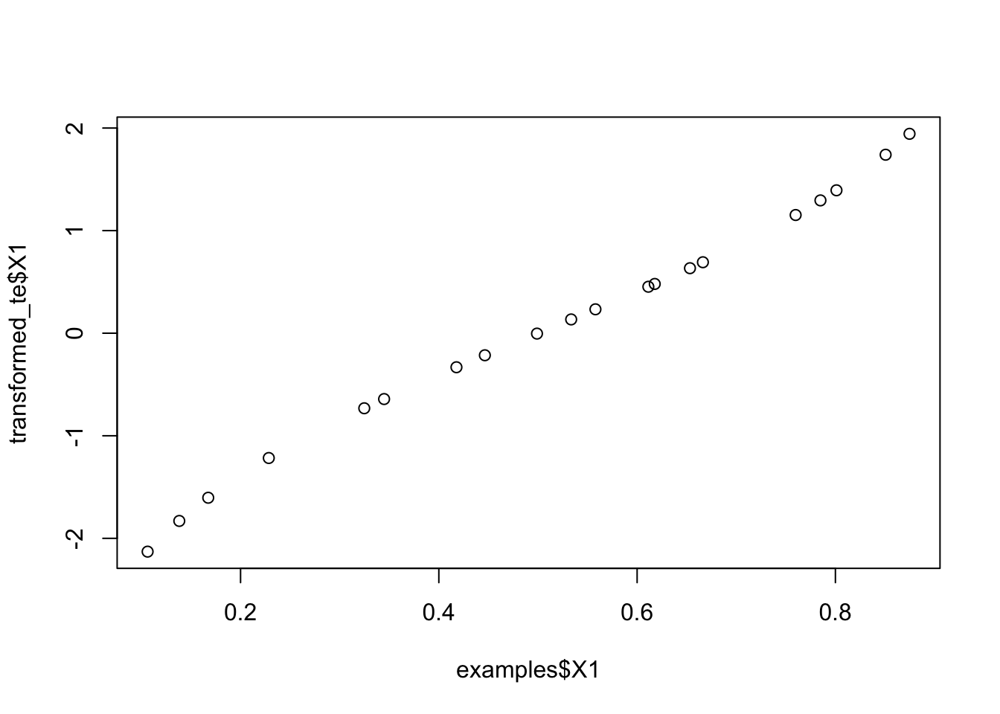

# Recipes  


```r
library(tidyverse)
library(recipes)
```

* 這張圖很好的解釋了`recipe`這個package的步驟：  

  

* specify variables:
  * 這一個步驟，就像寫食譜前，要先標清楚要用哪些食材的意思。  
  * 用`recipe()`來先標清楚各個variable的type和role。type就是numeric/nominal, role就是outcome/predictor  
  * 最簡單的一種寫法，就是這樣： `recipe(y~., data = data)`。那透過model formula，系統就知道每個欄位的角色了：y是outcome，其他所有欄位都是predictor。而放進去的data，只是讓系統去知道，每個欄位的type是什麼：factor/character會被判定為nominal, integer/numeric會被判定為numeric。  
  * 對於每個欄位的type和role，都還可以微調，這等等再細講  
* define pre-processing steps:   
  * 這一步驟，就是在寫食譜。把做一道菜的每一個步驟寫好  
  * 用一堆`step_*` function，來說明to-do事項有哪些。例如我要做one-hot encoding、我要補遺漏值、我要做normalize...    
  * 舉例來說，`step_log(total_time, base = 10)`，就表示我要對total_time這個欄位取log  
  
    
* provide datasets for recipe steps:   
  * 這一步驟，就是做菜前要先備料，的備料階段。  
  * 用`prep()` function，來prepare所需的材料(例如你要做one-hot encoding時，那個factor的levels到底有哪些？要做normalize時，你的mean和sd要給多少？你要給我一份實際的資料我才知道，這邊通常都是丟training data進去)  
* apply pre-processing:  
  * 這一步驟，就是實際來做菜了。  
  * 用`bake()`來實際對給定的資料做preprocessing   

## 先快速來個例子  

* 舉例來說，我有一筆 iris data，我先切成training/testing:  


```r
library(rsample)
set.seed(123)
iris_split = initial_split(iris, strata = Species)
iris_train = training(iris_split)
iris_test = testing(iris_split)
iris_train
#>     Sepal.Length Sepal.Width Petal.Length Petal.Width
#> 3            4.7         3.2          1.3         0.2
#> 4            4.6         3.1          1.5         0.2
#> 5            5.0         3.6          1.4         0.2
#> 7            4.6         3.4          1.4         0.3
#> 8            5.0         3.4          1.5         0.2
#> 9            4.4         2.9          1.4         0.2
#> 10           4.9         3.1          1.5         0.1
#> 11           5.4         3.7          1.5         0.2
#> 12           4.8         3.4          1.6         0.2
#> 13           4.8         3.0          1.4         0.1
#> 14           4.3         3.0          1.1         0.1
#> 15           5.8         4.0          1.2         0.2
#> 17           5.4         3.9          1.3         0.4
#> 18           5.1         3.5          1.4         0.3
#> 19           5.7         3.8          1.7         0.3
#> 20           5.1         3.8          1.5         0.3
#> 21           5.4         3.4          1.7         0.2
#> 24           5.1         3.3          1.7         0.5
#> 25           4.8         3.4          1.9         0.2
#> 26           5.0         3.0          1.6         0.2
#> 27           5.0         3.4          1.6         0.4
#> 28           5.2         3.5          1.5         0.2
#> 29           5.2         3.4          1.4         0.2
#> 30           4.7         3.2          1.6         0.2
#> 31           4.8         3.1          1.6         0.2
#> 32           5.4         3.4          1.5         0.4
#> 33           5.2         4.1          1.5         0.1
#> 36           5.0         3.2          1.2         0.2
#> 37           5.5         3.5          1.3         0.2
#> 40           5.1         3.4          1.5         0.2
#> 41           5.0         3.5          1.3         0.3
#> 42           4.5         2.3          1.3         0.3
#> 43           4.4         3.2          1.3         0.2
#> 45           5.1         3.8          1.9         0.4
#> 48           4.6         3.2          1.4         0.2
#> 49           5.3         3.7          1.5         0.2
#> 50           5.0         3.3          1.4         0.2
#> 52           6.4         3.2          4.5         1.5
#> 54           5.5         2.3          4.0         1.3
#> 55           6.5         2.8          4.6         1.5
#> 56           5.7         2.8          4.5         1.3
#> 57           6.3         3.3          4.7         1.6
#> 58           4.9         2.4          3.3         1.0
#> 59           6.6         2.9          4.6         1.3
#> 61           5.0         2.0          3.5         1.0
#> 62           5.9         3.0          4.2         1.5
#> 63           6.0         2.2          4.0         1.0
#> 65           5.6         2.9          3.6         1.3
#> 66           6.7         3.1          4.4         1.4
#> 67           5.6         3.0          4.5         1.5
#> 68           5.8         2.7          4.1         1.0
#> 69           6.2         2.2          4.5         1.5
#> 70           5.6         2.5          3.9         1.1
#> 71           5.9         3.2          4.8         1.8
#> 72           6.1         2.8          4.0         1.3
#> 73           6.3         2.5          4.9         1.5
#> 75           6.4         2.9          4.3         1.3
#> 76           6.6         3.0          4.4         1.4
#> 77           6.8         2.8          4.8         1.4
#> 78           6.7         3.0          5.0         1.7
#> 79           6.0         2.9          4.5         1.5
#> 82           5.5         2.4          3.7         1.0
#> 83           5.8         2.7          3.9         1.2
#> 84           6.0         2.7          5.1         1.6
#> 87           6.7         3.1          4.7         1.5
#> 88           6.3         2.3          4.4         1.3
#> 89           5.6         3.0          4.1         1.3
#> 91           5.5         2.6          4.4         1.2
#> 93           5.8         2.6          4.0         1.2
#> 95           5.6         2.7          4.2         1.3
#> 96           5.7         3.0          4.2         1.2
#> 98           6.2         2.9          4.3         1.3
#> 99           5.1         2.5          3.0         1.1
#> 100          5.7         2.8          4.1         1.3
#> 101          6.3         3.3          6.0         2.5
#> 102          5.8         2.7          5.1         1.9
#> 103          7.1         3.0          5.9         2.1
#> 104          6.3         2.9          5.6         1.8
#> 105          6.5         3.0          5.8         2.2
#> 107          4.9         2.5          4.5         1.7
#> 108          7.3         2.9          6.3         1.8
#> 110          7.2         3.6          6.1         2.5
#> 112          6.4         2.7          5.3         1.9
#> 114          5.7         2.5          5.0         2.0
#> 115          5.8         2.8          5.1         2.4
#> 118          7.7         3.8          6.7         2.2
#> 119          7.7         2.6          6.9         2.3
#> 120          6.0         2.2          5.0         1.5
#> 121          6.9         3.2          5.7         2.3
#> 122          5.6         2.8          4.9         2.0
#> 123          7.7         2.8          6.7         2.0
#> 125          6.7         3.3          5.7         2.1
#> 126          7.2         3.2          6.0         1.8
#> 127          6.2         2.8          4.8         1.8
#> 129          6.4         2.8          5.6         2.1
#> 130          7.2         3.0          5.8         1.6
#> 131          7.4         2.8          6.1         1.9
#> 132          7.9         3.8          6.4         2.0
#> 135          6.1         2.6          5.6         1.4
#> 136          7.7         3.0          6.1         2.3
#> 139          6.0         3.0          4.8         1.8
#> 140          6.9         3.1          5.4         2.1
#> 141          6.7         3.1          5.6         2.4
#> 142          6.9         3.1          5.1         2.3
#> 143          5.8         2.7          5.1         1.9
#> 144          6.8         3.2          5.9         2.3
#> 146          6.7         3.0          5.2         2.3
#> 147          6.3         2.5          5.0         1.9
#> 148          6.5         3.0          5.2         2.0
#> 149          6.2         3.4          5.4         2.3
#> 150          5.9         3.0          5.1         1.8
#>        Species
#> 3       setosa
#> 4       setosa
#> 5       setosa
#> 7       setosa
#> 8       setosa
#> 9       setosa
#> 10      setosa
#> 11      setosa
#> 12      setosa
#> 13      setosa
#> 14      setosa
#> 15      setosa
#> 17      setosa
#> 18      setosa
#> 19      setosa
#> 20      setosa
#> 21      setosa
#> 24      setosa
#> 25      setosa
#> 26      setosa
#> 27      setosa
#> 28      setosa
#> 29      setosa
#> 30      setosa
#> 31      setosa
#> 32      setosa
#> 33      setosa
#> 36      setosa
#> 37      setosa
#> 40      setosa
#> 41      setosa
#> 42      setosa
#> 43      setosa
#> 45      setosa
#> 48      setosa
#> 49      setosa
#> 50      setosa
#> 52  versicolor
#> 54  versicolor
#> 55  versicolor
#> 56  versicolor
#> 57  versicolor
#> 58  versicolor
#> 59  versicolor
#> 61  versicolor
#> 62  versicolor
#> 63  versicolor
#> 65  versicolor
#> 66  versicolor
#> 67  versicolor
#> 68  versicolor
#> 69  versicolor
#> 70  versicolor
#> 71  versicolor
#> 72  versicolor
#> 73  versicolor
#> 75  versicolor
#> 76  versicolor
#> 77  versicolor
#> 78  versicolor
#> 79  versicolor
#> 82  versicolor
#> 83  versicolor
#> 84  versicolor
#> 87  versicolor
#> 88  versicolor
#> 89  versicolor
#> 91  versicolor
#> 93  versicolor
#> 95  versicolor
#> 96  versicolor
#> 98  versicolor
#> 99  versicolor
#> 100 versicolor
#> 101  virginica
#> 102  virginica
#> 103  virginica
#> 104  virginica
#> 105  virginica
#> 107  virginica
#> 108  virginica
#> 110  virginica
#> 112  virginica
#> 114  virginica
#> 115  virginica
#> 118  virginica
#> 119  virginica
#> 120  virginica
#> 121  virginica
#> 122  virginica
#> 123  virginica
#> 125  virginica
#> 126  virginica
#> 127  virginica
#> 129  virginica
#> 130  virginica
#> 131  virginica
#> 132  virginica
#> 135  virginica
#> 136  virginica
#> 139  virginica
#> 140  virginica
#> 141  virginica
#> 142  virginica
#> 143  virginica
#> 144  virginica
#> 146  virginica
#> 147  virginica
#> 148  virginica
#> 149  virginica
#> 150  virginica
```

* 那從這筆資料，就可發現有5個變數，其中4個是連續型，一個是類別型  
* 那我用 `recipe(Species ~., data = iris_train)` ，就可定義好這些變數的 type 和 role：  


```r
iris_recipe <- recipe(Species ~ ., data = iris_train)
summary(iris_recipe)
#> # A tibble: 5 × 4
#>   variable     type    role      source  
#>   <chr>        <chr>   <chr>     <chr>   
#> 1 Sepal.Length numeric predictor original
#> 2 Sepal.Width  numeric predictor original
#> 3 Petal.Length numeric predictor original
#> 4 Petal.Width  numeric predictor original
#> 5 Species      nominal outcome   original
```

* 可以看到，藉由 `data = iris_train`，這個recipe物件就可以知道variable有哪 5 個，然後從這5個變數在此data中的型別，就可以得知他的type。  
* 接著，formula: `Species ~ .`，這個recipe物件就可以知道Species的role是outcome，而其他都是predictor 
* 特別提醒：  
  * 這邊的formula，不是最後我們要fit model所用的formula。這個formula只是為了定義出各個變數的角色而已。  
  * 這邊的data，也不是我們要fit model所用的data。這邊的data只是讓我知道總共有哪些變數，各個變數的type是什麼而已。所以這邊你要放iris_train, iris_test, iris, 甚至cv的data， 都隨便你，只要這個data裡有你想specify的變數，且這個data各個變數的type都是正確的就好。  

* 接下來看第二步驟，我想把type = numeric 的變數，都做normalize:  


```r
iris_recipe <- recipe(Species ~ ., data = iris_train) %>%
  step_normalize(all_numeric())

iris_recipe
#> Recipe
#> 
#> Inputs:
#> 
#>       role #variables
#>    outcome          1
#>  predictor          4
#> 
#> Operations:
#> 
#> Centering and scaling for all_numeric()
```

* 可以看到Operations裡面，寫了Centering and scaling for all_numeric()    
* 接下來，我要prepare我的資料了。我在prep裡面，放入iris_train。那normalize的mean和sd，就都會根據iris_train來計算出來  


```r
iris_rec_prep <- iris_recipe %>% 
  prep(training = iris_train)
```

* 最後，應用到testing set  


```r
iris_rec_prep %>%
  bake(new_data = iris_test)
#> # A tibble: 39 × 5
#>    Sepal.Length Sepal.Width Petal.Length Petal.Width Species
#>           <dbl>       <dbl>        <dbl>       <dbl> <fct>  
#>  1       -0.886      1.11          -1.33       -1.30 setosa 
#>  2       -1.12      -0.0744        -1.33       -1.30 setosa 
#>  3       -0.534      2.05          -1.17       -1.04 setosa 
#>  4       -0.182      3.23          -1.28       -1.04 setosa 
#>  5       -0.886      1.58          -1.28       -1.04 setosa 
#>  6       -1.47       1.34          -1.56       -1.30 setosa 
#>  7       -0.417      2.76          -1.33       -1.30 setosa 
#>  8       -1.12       0.162         -1.28       -1.30 setosa 
#>  9       -1.12       1.34          -1.33       -1.43 setosa 
#> 10       -1.71      -0.0744        -1.39       -1.30 setosa 
#> # … with 29 more rows
```

* 接下來各章，就要來講細節  

## Specify Variables  

### 定義各個變數的 type 和 role  

* 這一步其實就像是資料庫裡面給schema or meta-data 的感覺，我們要去定義每個變數的：  
  * type: 這個變數的type是nominal or continuous    
  * role: 這個變數的角色是 predictor or response  
* 那最簡單的寫法，就是給他 formula + 一組資料，這樣就能快速的搞定每個variable的type和role。  
* 舉例來說，我有一筆 iris data:  


```r
iris
#>     Sepal.Length Sepal.Width Petal.Length Petal.Width
#> 1            5.1         3.5          1.4         0.2
#> 2            4.9         3.0          1.4         0.2
#> 3            4.7         3.2          1.3         0.2
#> 4            4.6         3.1          1.5         0.2
#> 5            5.0         3.6          1.4         0.2
#> 6            5.4         3.9          1.7         0.4
#> 7            4.6         3.4          1.4         0.3
#> 8            5.0         3.4          1.5         0.2
#> 9            4.4         2.9          1.4         0.2
#> 10           4.9         3.1          1.5         0.1
#> 11           5.4         3.7          1.5         0.2
#> 12           4.8         3.4          1.6         0.2
#> 13           4.8         3.0          1.4         0.1
#> 14           4.3         3.0          1.1         0.1
#> 15           5.8         4.0          1.2         0.2
#> 16           5.7         4.4          1.5         0.4
#> 17           5.4         3.9          1.3         0.4
#> 18           5.1         3.5          1.4         0.3
#> 19           5.7         3.8          1.7         0.3
#> 20           5.1         3.8          1.5         0.3
#> 21           5.4         3.4          1.7         0.2
#> 22           5.1         3.7          1.5         0.4
#> 23           4.6         3.6          1.0         0.2
#> 24           5.1         3.3          1.7         0.5
#> 25           4.8         3.4          1.9         0.2
#> 26           5.0         3.0          1.6         0.2
#> 27           5.0         3.4          1.6         0.4
#> 28           5.2         3.5          1.5         0.2
#> 29           5.2         3.4          1.4         0.2
#> 30           4.7         3.2          1.6         0.2
#> 31           4.8         3.1          1.6         0.2
#> 32           5.4         3.4          1.5         0.4
#> 33           5.2         4.1          1.5         0.1
#> 34           5.5         4.2          1.4         0.2
#> 35           4.9         3.1          1.5         0.2
#> 36           5.0         3.2          1.2         0.2
#> 37           5.5         3.5          1.3         0.2
#> 38           4.9         3.6          1.4         0.1
#> 39           4.4         3.0          1.3         0.2
#> 40           5.1         3.4          1.5         0.2
#> 41           5.0         3.5          1.3         0.3
#> 42           4.5         2.3          1.3         0.3
#> 43           4.4         3.2          1.3         0.2
#> 44           5.0         3.5          1.6         0.6
#> 45           5.1         3.8          1.9         0.4
#> 46           4.8         3.0          1.4         0.3
#> 47           5.1         3.8          1.6         0.2
#> 48           4.6         3.2          1.4         0.2
#> 49           5.3         3.7          1.5         0.2
#> 50           5.0         3.3          1.4         0.2
#> 51           7.0         3.2          4.7         1.4
#> 52           6.4         3.2          4.5         1.5
#> 53           6.9         3.1          4.9         1.5
#> 54           5.5         2.3          4.0         1.3
#> 55           6.5         2.8          4.6         1.5
#> 56           5.7         2.8          4.5         1.3
#> 57           6.3         3.3          4.7         1.6
#> 58           4.9         2.4          3.3         1.0
#> 59           6.6         2.9          4.6         1.3
#> 60           5.2         2.7          3.9         1.4
#> 61           5.0         2.0          3.5         1.0
#> 62           5.9         3.0          4.2         1.5
#> 63           6.0         2.2          4.0         1.0
#> 64           6.1         2.9          4.7         1.4
#> 65           5.6         2.9          3.6         1.3
#> 66           6.7         3.1          4.4         1.4
#> 67           5.6         3.0          4.5         1.5
#> 68           5.8         2.7          4.1         1.0
#> 69           6.2         2.2          4.5         1.5
#> 70           5.6         2.5          3.9         1.1
#> 71           5.9         3.2          4.8         1.8
#> 72           6.1         2.8          4.0         1.3
#> 73           6.3         2.5          4.9         1.5
#> 74           6.1         2.8          4.7         1.2
#> 75           6.4         2.9          4.3         1.3
#> 76           6.6         3.0          4.4         1.4
#> 77           6.8         2.8          4.8         1.4
#> 78           6.7         3.0          5.0         1.7
#> 79           6.0         2.9          4.5         1.5
#> 80           5.7         2.6          3.5         1.0
#> 81           5.5         2.4          3.8         1.1
#> 82           5.5         2.4          3.7         1.0
#> 83           5.8         2.7          3.9         1.2
#> 84           6.0         2.7          5.1         1.6
#> 85           5.4         3.0          4.5         1.5
#> 86           6.0         3.4          4.5         1.6
#> 87           6.7         3.1          4.7         1.5
#> 88           6.3         2.3          4.4         1.3
#> 89           5.6         3.0          4.1         1.3
#> 90           5.5         2.5          4.0         1.3
#> 91           5.5         2.6          4.4         1.2
#> 92           6.1         3.0          4.6         1.4
#> 93           5.8         2.6          4.0         1.2
#> 94           5.0         2.3          3.3         1.0
#> 95           5.6         2.7          4.2         1.3
#> 96           5.7         3.0          4.2         1.2
#> 97           5.7         2.9          4.2         1.3
#> 98           6.2         2.9          4.3         1.3
#> 99           5.1         2.5          3.0         1.1
#> 100          5.7         2.8          4.1         1.3
#> 101          6.3         3.3          6.0         2.5
#> 102          5.8         2.7          5.1         1.9
#> 103          7.1         3.0          5.9         2.1
#> 104          6.3         2.9          5.6         1.8
#> 105          6.5         3.0          5.8         2.2
#> 106          7.6         3.0          6.6         2.1
#> 107          4.9         2.5          4.5         1.7
#> 108          7.3         2.9          6.3         1.8
#> 109          6.7         2.5          5.8         1.8
#> 110          7.2         3.6          6.1         2.5
#> 111          6.5         3.2          5.1         2.0
#> 112          6.4         2.7          5.3         1.9
#> 113          6.8         3.0          5.5         2.1
#> 114          5.7         2.5          5.0         2.0
#> 115          5.8         2.8          5.1         2.4
#> 116          6.4         3.2          5.3         2.3
#> 117          6.5         3.0          5.5         1.8
#> 118          7.7         3.8          6.7         2.2
#> 119          7.7         2.6          6.9         2.3
#> 120          6.0         2.2          5.0         1.5
#> 121          6.9         3.2          5.7         2.3
#> 122          5.6         2.8          4.9         2.0
#> 123          7.7         2.8          6.7         2.0
#> 124          6.3         2.7          4.9         1.8
#> 125          6.7         3.3          5.7         2.1
#> 126          7.2         3.2          6.0         1.8
#> 127          6.2         2.8          4.8         1.8
#> 128          6.1         3.0          4.9         1.8
#> 129          6.4         2.8          5.6         2.1
#> 130          7.2         3.0          5.8         1.6
#> 131          7.4         2.8          6.1         1.9
#> 132          7.9         3.8          6.4         2.0
#> 133          6.4         2.8          5.6         2.2
#> 134          6.3         2.8          5.1         1.5
#> 135          6.1         2.6          5.6         1.4
#> 136          7.7         3.0          6.1         2.3
#> 137          6.3         3.4          5.6         2.4
#> 138          6.4         3.1          5.5         1.8
#> 139          6.0         3.0          4.8         1.8
#> 140          6.9         3.1          5.4         2.1
#> 141          6.7         3.1          5.6         2.4
#> 142          6.9         3.1          5.1         2.3
#> 143          5.8         2.7          5.1         1.9
#> 144          6.8         3.2          5.9         2.3
#> 145          6.7         3.3          5.7         2.5
#> 146          6.7         3.0          5.2         2.3
#> 147          6.3         2.5          5.0         1.9
#> 148          6.5         3.0          5.2         2.0
#> 149          6.2         3.4          5.4         2.3
#> 150          5.9         3.0          5.1         1.8
#>        Species
#> 1       setosa
#> 2       setosa
#> 3       setosa
#> 4       setosa
#> 5       setosa
#> 6       setosa
#> 7       setosa
#> 8       setosa
#> 9       setosa
#> 10      setosa
#> 11      setosa
#> 12      setosa
#> 13      setosa
#> 14      setosa
#> 15      setosa
#> 16      setosa
#> 17      setosa
#> 18      setosa
#> 19      setosa
#> 20      setosa
#> 21      setosa
#> 22      setosa
#> 23      setosa
#> 24      setosa
#> 25      setosa
#> 26      setosa
#> 27      setosa
#> 28      setosa
#> 29      setosa
#> 30      setosa
#> 31      setosa
#> 32      setosa
#> 33      setosa
#> 34      setosa
#> 35      setosa
#> 36      setosa
#> 37      setosa
#> 38      setosa
#> 39      setosa
#> 40      setosa
#> 41      setosa
#> 42      setosa
#> 43      setosa
#> 44      setosa
#> 45      setosa
#> 46      setosa
#> 47      setosa
#> 48      setosa
#> 49      setosa
#> 50      setosa
#> 51  versicolor
#> 52  versicolor
#> 53  versicolor
#> 54  versicolor
#> 55  versicolor
#> 56  versicolor
#> 57  versicolor
#> 58  versicolor
#> 59  versicolor
#> 60  versicolor
#> 61  versicolor
#> 62  versicolor
#> 63  versicolor
#> 64  versicolor
#> 65  versicolor
#> 66  versicolor
#> 67  versicolor
#> 68  versicolor
#> 69  versicolor
#> 70  versicolor
#> 71  versicolor
#> 72  versicolor
#> 73  versicolor
#> 74  versicolor
#> 75  versicolor
#> 76  versicolor
#> 77  versicolor
#> 78  versicolor
#> 79  versicolor
#> 80  versicolor
#> 81  versicolor
#> 82  versicolor
#> 83  versicolor
#> 84  versicolor
#> 85  versicolor
#> 86  versicolor
#> 87  versicolor
#> 88  versicolor
#> 89  versicolor
#> 90  versicolor
#> 91  versicolor
#> 92  versicolor
#> 93  versicolor
#> 94  versicolor
#> 95  versicolor
#> 96  versicolor
#> 97  versicolor
#> 98  versicolor
#> 99  versicolor
#> 100 versicolor
#> 101  virginica
#> 102  virginica
#> 103  virginica
#> 104  virginica
#> 105  virginica
#> 106  virginica
#> 107  virginica
#> 108  virginica
#> 109  virginica
#> 110  virginica
#> 111  virginica
#> 112  virginica
#> 113  virginica
#> 114  virginica
#> 115  virginica
#> 116  virginica
#> 117  virginica
#> 118  virginica
#> 119  virginica
#> 120  virginica
#> 121  virginica
#> 122  virginica
#> 123  virginica
#> 124  virginica
#> 125  virginica
#> 126  virginica
#> 127  virginica
#> 128  virginica
#> 129  virginica
#> 130  virginica
#> 131  virginica
#> 132  virginica
#> 133  virginica
#> 134  virginica
#> 135  virginica
#> 136  virginica
#> 137  virginica
#> 138  virginica
#> 139  virginica
#> 140  virginica
#> 141  virginica
#> 142  virginica
#> 143  virginica
#> 144  virginica
#> 145  virginica
#> 146  virginica
#> 147  virginica
#> 148  virginica
#> 149  virginica
#> 150  virginica
```

* 那從這筆資料，就可發現有5個變數，其中4個是連續型，一個是類別型  
* 那我用 `recipe(Species ~., data = iris)` ，就可定義好這些變數的 type 和 role：  


```r
iris_recipe <- recipe(Species ~ ., data = iris)
summary(iris_recipe)
#> # A tibble: 5 × 4
#>   variable     type    role      source  
#>   <chr>        <chr>   <chr>     <chr>   
#> 1 Sepal.Length numeric predictor original
#> 2 Sepal.Width  numeric predictor original
#> 3 Petal.Length numeric predictor original
#> 4 Petal.Width  numeric predictor original
#> 5 Species      nominal outcome   original
```

* 可以看到，藉由 `data = iris`，這個recipe物件就可以知道variable有哪 5 個，然後從這5個變數在此data中的型別，就可以得知他的type。  
* 接著，formula: `Species ~ .`，這個recipe物件就可以知道Species的role是outcome，而其他都是predictor 
* 特別提醒：  
  * 這邊的formula，不是最後我們要fit model所用的formula。這個formula只是為了定義出各個變數的角色而已。  
  * 這邊的data，也不是我們要fit model所用的data。這邊的data只是讓我知道總共有哪些變數，各個變數的type是什麼而已。所以這邊你要放training data, testing data, total_data, cv_data 都隨便你，只要這個data裡有你想specify的變數，且這個data各個變數的type都是正確的就好。  
* 有了這個概念後，就可以來舉一反三了，例如，我想指名Species是predictor就好：  


```r
recipe(~Species, data = iris) %>% summary()
#> # A tibble: 1 × 4
#>   variable type    role      source  
#>   <chr>    <chr>   <chr>     <chr>   
#> 1 Species  nominal predictor original
```

* 我想指名 `Sepal.Length` & `Sepal.Width` 是 outcome，其他都是 predictor:  


```r
recipe(Sepal.Length + Sepal.Width ~ ., data = iris) %>% summary()
#> # A tibble: 5 × 4
#>   variable     type    role      source  
#>   <chr>        <chr>   <chr>     <chr>   
#> 1 Petal.Length numeric predictor original
#> 2 Petal.Width  numeric predictor original
#> 3 Species      nominal predictor original
#> 4 Sepal.Length numeric outcome   original
#> 5 Sepal.Width  numeric outcome   original
```

* 我覺得大家都是 predictor  


```r
recipe(~ ., data = iris) %>% summary()
#> # A tibble: 5 × 4
#>   variable     type    role      source  
#>   <chr>        <chr>   <chr>     <chr>   
#> 1 Sepal.Length numeric predictor original
#> 2 Sepal.Width  numeric predictor original
#> 3 Petal.Length numeric predictor original
#> 4 Petal.Width  numeric predictor original
#> 5 Species      nominal predictor original
```

* 我不想指定role，只想指定type  


```r
recipe(iris) %>% summary()
#> # A tibble: 5 × 4
#>   variable     type    role  source  
#>   <chr>        <chr>   <lgl> <chr>   
#> 1 Sepal.Length numeric NA    original
#> 2 Sepal.Width  numeric NA    original
#> 3 Petal.Length numeric NA    original
#> 4 Petal.Width  numeric NA    original
#> 5 Species      nominal NA    original
```

### update_role  

* 如果我想更新某些變數的角色，那我可以用 `update_role()`  
* 舉例來說，剛剛的iris data，我目前的recipe長這樣：  


```r
iris_recipe <- recipe(Species ~ ., data = iris)
summary(iris_recipe)
#> # A tibble: 5 × 4
#>   variable     type    role      source  
#>   <chr>        <chr>   <chr>     <chr>   
#> 1 Sepal.Length numeric predictor original
#> 2 Sepal.Width  numeric predictor original
#> 3 Petal.Length numeric predictor original
#> 4 Petal.Width  numeric predictor original
#> 5 Species      nominal outcome   original
```

* 那我如果突然不想做supervised learning了，我想做做分群或PCA等unsupervised learning，那我就把`outcome`的role，轉成`predictor`  


```r
iris_recipe %>%
  update_role(Species, new_role = "predictor") %>%
  summary()
#> # A tibble: 5 × 4
#>   variable     type    role      source  
#>   <chr>        <chr>   <chr>     <chr>   
#> 1 Sepal.Length numeric predictor original
#> 2 Sepal.Width  numeric predictor original
#> 3 Petal.Length numeric predictor original
#> 4 Petal.Width  numeric predictor original
#> 5 Species      nominal predictor original
```

* 甚至，這些變數其實也不是predictor了，因為在unsupervised learning裡，根本沒predictor這種東西。那我可以更新他們的角色，叫做"characteristic"。這個名稱隨便你取，你取啥都可以：  


```r
iris_recipe %>%
  update_role(everything(), new_role = "characteristic") %>%
  summary()
#> # A tibble: 5 × 4
#>   variable     type    role           source  
#>   <chr>        <chr>   <chr>          <chr>   
#> 1 Sepal.Length numeric characteristic original
#> 2 Sepal.Width  numeric characteristic original
#> 3 Petal.Length numeric characteristic original
#> 4 Petal.Width  numeric characteristic original
#> 5 Species      nominal characteristic original
```

### role inheritance  

* 等等會學很多step_function，他會改變我原先的變數。那變數改變後，他的角色會變怎樣？  
* 答案是，角色會繼承(預設)。或是，你在做step_function時，直接assign給他新角色。  


```r
recipe( ~ ., data = iris) %>% 
  step_dummy(Species) %>% 
  prep(training = iris) %>% 
  summary()
#> # A tibble: 6 × 4
#>   variable           type    role      source  
#>   <chr>              <chr>   <chr>     <chr>   
#> 1 Sepal.Length       numeric predictor original
#> 2 Sepal.Width        numeric predictor original
#> 3 Petal.Length       numeric predictor original
#> 4 Petal.Width        numeric predictor original
#> 5 Species_versicolor numeric predictor derived 
#> 6 Species_virginica  numeric predictor derived
```

* 可以看到，Species已經被轉成Species_versicolor和Species_virginica了。  
* 會轉成這兩個level，是靠`prep()`裡面的data來轉的。  
* 而轉完的role，仍然是predictor。而source可以看到，從original變成derived，因為這是後續生出來的變數  
* 那另一個例子是，我做step_dummy時，直接assign給他新角色，例如：  


```r
recipe( ~ ., data = iris) %>% 
  step_dummy(Species, role = "trousers") %>% 
  prep() %>% 
  summary()
#> # A tibble: 6 × 4
#>   variable           type    role      source  
#>   <chr>              <chr>   <chr>     <chr>   
#> 1 Sepal.Length       numeric predictor original
#> 2 Sepal.Width        numeric predictor original
#> 3 Petal.Length       numeric predictor original
#> 4 Petal.Width        numeric predictor original
#> 5 Species_versicolor numeric trousers  derived 
#> 6 Species_virginica  numeric trousers  derived
```

* 這邊就可以看到，本來Species在最一開始，是predictor的角色，但我在做step_dummy時，assign他轉換後的結果要是"trousers"這個角色。那轉完就可以看到role的確是 trousers  


## Selecting Variables  

* 上一章定義完變數的meta-data後，現在每個變數都具有三個特徵：  
  * 這個變數的名字  
  * 這個變數的type  
  * 這個變數的role  
* 所以，我在選擇變數的時候，我就可以善用這三個特徵來選變數  

### 用名字選變數  

* 舉例來說，我的step_dummy，想做在 species 上，那我可以寫：  


```r
recipe(Species ~ ., data = iris) %>%
  step_dummy(Species) %>%
  prep() %>%
  juice()
#> # A tibble: 150 × 6
#>    Sepal.Length Sepal.Width Petal.Length Petal.Width
#>           <dbl>       <dbl>        <dbl>       <dbl>
#>  1          5.1         3.5          1.4         0.2
#>  2          4.9         3            1.4         0.2
#>  3          4.7         3.2          1.3         0.2
#>  4          4.6         3.1          1.5         0.2
#>  5          5           3.6          1.4         0.2
#>  6          5.4         3.9          1.7         0.4
#>  7          4.6         3.4          1.4         0.3
#>  8          5           3.4          1.5         0.2
#>  9          4.4         2.9          1.4         0.2
#> 10          4.9         3.1          1.5         0.1
#> # … with 140 more rows, and 2 more variables:
#> #   Species_versicolor <dbl>, Species_virginica <dbl>
```

* 我也可以用dplyr的`starts_with()`, `end_with()`,...來選變數。例如：  


```r
recipe(Species ~ ., data = iris) %>%
  step_normalize(starts_with("Sepal")) %>%
  prep() %>%
  juice()
#> # A tibble: 150 × 5
#>    Sepal.Length Sepal.Width Petal.Length Petal.Width Species
#>           <dbl>       <dbl>        <dbl>       <dbl> <fct>  
#>  1       -0.898      1.02            1.4         0.2 setosa 
#>  2       -1.14      -0.132           1.4         0.2 setosa 
#>  3       -1.38       0.327           1.3         0.2 setosa 
#>  4       -1.50       0.0979          1.5         0.2 setosa 
#>  5       -1.02       1.25            1.4         0.2 setosa 
#>  6       -0.535      1.93            1.7         0.4 setosa 
#>  7       -1.50       0.786           1.4         0.3 setosa 
#>  8       -1.02       0.786           1.5         0.2 setosa 
#>  9       -1.74      -0.361           1.4         0.2 setosa 
#> 10       -1.14       0.0979          1.5         0.1 setosa 
#> # … with 140 more rows
```

### 用type選變數  

* 變數的type有nominal和 numeric，所以，我可以這樣做：  

#### all_numeric()  


```r
recipe(Species ~ ., data = iris) %>%
  step_normalize(all_numeric()) %>%
  prep() %>%
  juice()
#> # A tibble: 150 × 5
#>    Sepal.Length Sepal.Width Petal.Length Petal.Width Species
#>           <dbl>       <dbl>        <dbl>       <dbl> <fct>  
#>  1       -0.898      1.02          -1.34       -1.31 setosa 
#>  2       -1.14      -0.132         -1.34       -1.31 setosa 
#>  3       -1.38       0.327         -1.39       -1.31 setosa 
#>  4       -1.50       0.0979        -1.28       -1.31 setosa 
#>  5       -1.02       1.25          -1.34       -1.31 setosa 
#>  6       -0.535      1.93          -1.17       -1.05 setosa 
#>  7       -1.50       0.786         -1.34       -1.18 setosa 
#>  8       -1.02       0.786         -1.28       -1.31 setosa 
#>  9       -1.74      -0.361         -1.34       -1.31 setosa 
#> 10       -1.14       0.0979        -1.28       -1.44 setosa 
#> # … with 140 more rows
```

#### all_nominal()  


```r
recipe(Species ~ ., data = iris) %>%
  step_dummy(all_nominal()) %>%
  prep() %>%
  juice()
#> # A tibble: 150 × 6
#>    Sepal.Length Sepal.Width Petal.Length Petal.Width
#>           <dbl>       <dbl>        <dbl>       <dbl>
#>  1          5.1         3.5          1.4         0.2
#>  2          4.9         3            1.4         0.2
#>  3          4.7         3.2          1.3         0.2
#>  4          4.6         3.1          1.5         0.2
#>  5          5           3.6          1.4         0.2
#>  6          5.4         3.9          1.7         0.4
#>  7          4.6         3.4          1.4         0.3
#>  8          5           3.4          1.5         0.2
#>  9          4.4         2.9          1.4         0.2
#> 10          4.9         3.1          1.5         0.1
#> # … with 140 more rows, and 2 more variables:
#> #   Species_versicolor <dbl>, Species_virginica <dbl>
```

### 用role選變數  

#### all_predictors()  


```r
recipe(Species ~ ., data = iris) %>%
  step_normalize(all_predictors()) %>%
  prep() %>%
  juice()
#> # A tibble: 150 × 5
#>    Sepal.Length Sepal.Width Petal.Length Petal.Width Species
#>           <dbl>       <dbl>        <dbl>       <dbl> <fct>  
#>  1       -0.898      1.02          -1.34       -1.31 setosa 
#>  2       -1.14      -0.132         -1.34       -1.31 setosa 
#>  3       -1.38       0.327         -1.39       -1.31 setosa 
#>  4       -1.50       0.0979        -1.28       -1.31 setosa 
#>  5       -1.02       1.25          -1.34       -1.31 setosa 
#>  6       -0.535      1.93          -1.17       -1.05 setosa 
#>  7       -1.50       0.786         -1.34       -1.18 setosa 
#>  8       -1.02       0.786         -1.28       -1.31 setosa 
#>  9       -1.74      -0.361         -1.34       -1.31 setosa 
#> 10       -1.14       0.0979        -1.28       -1.44 setosa 
#> # … with 140 more rows
```

#### all_outcomes()  


```r
recipe(Species ~ ., data = iris) %>%
  step_dummy(all_outcomes()) %>%
  prep() %>%
  juice()
#> # A tibble: 150 × 6
#>    Sepal.Length Sepal.Width Petal.Length Petal.Width
#>           <dbl>       <dbl>        <dbl>       <dbl>
#>  1          5.1         3.5          1.4         0.2
#>  2          4.9         3            1.4         0.2
#>  3          4.7         3.2          1.3         0.2
#>  4          4.6         3.1          1.5         0.2
#>  5          5           3.6          1.4         0.2
#>  6          5.4         3.9          1.7         0.4
#>  7          4.6         3.4          1.4         0.3
#>  8          5           3.4          1.5         0.2
#>  9          4.4         2.9          1.4         0.2
#> 10          4.9         3.1          1.5         0.1
#> # … with 140 more rows, and 2 more variables:
#> #   Species_versicolor <dbl>, Species_virginica <dbl>
```

#### has_role()  


```r
recipe(Species ~ ., 
       data = iris %>% mutate(money = rnorm(n = 150, mean = 100000, sd = 1000))) %>%
  update_role(money, new_role = "whatever") %>%
  step_log(has_role("whatever")) %>%
  prep() %>%
  juice()
#> # A tibble: 150 × 6
#>    Sepal.Length Sepal.Width Petal.Length Petal.Width money
#>           <dbl>       <dbl>        <dbl>       <dbl> <dbl>
#>  1          5.1         3.5          1.4         0.2  11.5
#>  2          4.9         3            1.4         0.2  11.5
#>  3          4.7         3.2          1.3         0.2  11.5
#>  4          4.6         3.1          1.5         0.2  11.5
#>  5          5           3.6          1.4         0.2  11.5
#>  6          5.4         3.9          1.7         0.4  11.5
#>  7          4.6         3.4          1.4         0.3  11.5
#>  8          5           3.4          1.5         0.2  11.5
#>  9          4.4         2.9          1.4         0.2  11.5
#> 10          4.9         3.1          1.5         0.1  11.5
#> # … with 140 more rows, and 1 more variable: Species <fct>
```

### 全部參雜在一起選變數  

* 例如我可以選全部的 "type = numeric" but "role != outcome"的變數，做log處理  


```r
recipe(money ~ ., data = iris %>% mutate(money = rnorm(150, 100000, 1000))) %>%
  step_normalize(all_numeric(), -all_outcomes()) %>%
  prep() %>%
  juice()
#> # A tibble: 150 × 6
#>    Sepal.Length Sepal.Width Petal.Length Petal.Width Species
#>           <dbl>       <dbl>        <dbl>       <dbl> <fct>  
#>  1       -0.898      1.02          -1.34       -1.31 setosa 
#>  2       -1.14      -0.132         -1.34       -1.31 setosa 
#>  3       -1.38       0.327         -1.39       -1.31 setosa 
#>  4       -1.50       0.0979        -1.28       -1.31 setosa 
#>  5       -1.02       1.25          -1.34       -1.31 setosa 
#>  6       -0.535      1.93          -1.17       -1.05 setosa 
#>  7       -1.50       0.786         -1.34       -1.18 setosa 
#>  8       -1.02       0.786         -1.28       -1.31 setosa 
#>  9       -1.74      -0.361         -1.34       -1.31 setosa 
#> 10       -1.14       0.0979        -1.28       -1.44 setosa 
#> # … with 140 more rows, and 1 more variable: money <dbl>
```

* 也有一些 compund selectors，例如： `all_nominal_predictors()` or `all_numeric_predictors()`  

## Define Preprocessing Steps  

### Impute missing values  

#### step_unknown    

* 如果 cat1 是個類別變數，然後資料裡面有 missing，我們可以用 `step_unknown()`，把missing的地方幫他補成 "unknown"  


```r
df_train = data.frame(
  cat1 = c("A","A","B",NA, "C"),
  cont1 = 1:5
)
my_unknown = recipe(~., data = df_train) %>%
  step_unknown(cat1) %>%
  prep(training = df_train)

bake(my_unknown, df_train)
#> # A tibble: 5 × 2
#>   cat1    cont1
#>   <fct>   <int>
#> 1 A           1
#> 2 A           2
#> 3 B           3
#> 4 unknown     4
#> 5 C           5
```

* 也可以加上 `new_level = "xxx"`，來把 unknown 換成你喜歡的 level  


```r
my_unknown2 = recipe(~., data = df_train) %>%
  step_unknown(cat1, new_level = "missing_catcat") %>%
  prep(training = df_train)

bake(my_unknown2, df_train)
#> # A tibble: 5 × 2
#>   cat1           cont1
#>   <fct>          <int>
#> 1 A                  1
#> 2 A                  2
#> 3 B                  3
#> 4 missing_catcat     4
#> 5 C                  5
```

### 對 categorical variables常見的處理  

#### step_dummy    

##### dummy coding  

* 雖然，很多package都有內建這個功能(e.g. lm()會自動把factor變數做dummy)，但各個package常常有不一致的地方：  
  * 有的package用dummy coding，有的用one-hot encoding  
  * 各個package在做dummy/one-hot時，命名方式也不一樣  
* 所以，我們可以在前處理的時候，用recipe先把類別變數都統一的轉好，那丟到不同model的engine時，就不用再管之後彼此會出現不一致了  
* 繼續舉剛剛的例子，並且先建立一個original欄位，：  


```r
iris2 <- iris %>% mutate(Species_old = Species)
iris_dummy = recipe( ~ ., data = iris2) %>% 
  step_dummy(Species) %>% 
  prep(training = iris2)
summary(iris_dummy)
#> # A tibble: 7 × 4
#>   variable           type    role      source  
#>   <chr>              <chr>   <chr>     <chr>   
#> 1 Sepal.Length       numeric predictor original
#> 2 Sepal.Width        numeric predictor original
#> 3 Petal.Length       numeric predictor original
#> 4 Petal.Width        numeric predictor original
#> 5 Species_old        nominal predictor original
#> 6 Species_versicolor numeric predictor derived 
#> 7 Species_virginica  numeric predictor derived
```

* 做轉換：  


```r
iris_dummy %>%
  bake(new_data = iris2) %>%
  select(Species_old, starts_with("Species")) %>%
  distinct()
#> # A tibble: 3 × 3
#>   Species_old Species_versicolor Species_virginica
#>   <fct>                    <dbl>             <dbl>
#> 1 setosa                       0                 0
#> 2 versicolor                   1                 0
#> 3 virginica                    0                 1
```

##### contrast  

* 在實驗設計裡，還有不同的dummy coding方式，例如sum coding, helmert coding, ...  
* 和 dummy 的差別是，他coding完可能是用 sum = 0 的方式 (e.g. coding成 c(-1, 0, 1))  
* 那這部分在 recipe 的網站上有範例 (ARTICLES/DUMMY VARIABLES ...)，我這邊很少用就先不整理了  

##### one-hot coding  

* 加上 `one_hot = TRUE` 就好  


```r
iris2 <- iris %>% mutate(Species_old = Species)
iris_onehot = recipe( ~ ., data = iris2) %>% 
  step_dummy(Species, one_hot = TRUE) %>% 
  prep(training = iris2)
iris_onehot %>%
  bake(new_data = iris2) %>%
  select(Species_old, starts_with("Species")) %>%
  distinct()
#> # A tibble: 3 × 4
#>   Species_old Species_setosa Species_versicolor
#>   <fct>                <dbl>              <dbl>
#> 1 setosa                   1                  0
#> 2 versicolor               0                  1
#> 3 virginica                0                  0
#> # … with 1 more variable: Species_virginica <dbl>
```


#### step_other  

* 對於類別變數，我們可以把出現頻率較少的level，全都整併成 others 
* 如果bake的時候，餵進來的變數，有新的level，那他也會被併到 others 裡面  
* 以下舉例：  


```r
df_train = data.frame(
  cat1 = c(rep("A",50), rep("B",40), rep("C", 5), rep("D", 5)),
  cont1 = rnorm(100)
)

df_train %>%
  count(cat1) %>%
  mutate(p = prop.table(n))
#>   cat1  n    p
#> 1    A 50 0.50
#> 2    B 40 0.40
#> 3    C  5 0.05
#> 4    D  5 0.05
```

* 上面這個資料集，training data的cat1有4個level，而C和D是很少出現的類別(各只有5%)  
* 我們如果用`step_dummy()`，就可以把小於threshold的類別合併為others，例如：  


```r
my_other = recipe(~., data = df_train) %>%
  step_other(cat1, threshold = 0.1) %>%
  prep(train = df_train)

my_other %>%
  bake(new_data = df_train) %>%
  count(cat1)
#> # A tibble: 3 × 2
#>   cat1      n
#>   <fct> <int>
#> 1 A        50
#> 2 B        40
#> 3 other    10
```

* 那如果我今天的test data裡面，cat1這個變數的分佈長這樣：  


```r
df_test = data.frame(
  cat1 = c(rep("A",2), rep("B",2), rep("C", 2), rep("D", 2), rep("E",2)),
  cont1 = rnorm(10)
)
df_test %>%
  count(cat1) %>%
  mutate(p = prop.table(n))
#>   cat1 n   p
#> 1    A 2 0.2
#> 2    B 2 0.2
#> 3    C 2 0.2
#> 4    D 2 0.2
#> 5    E 2 0.2
```

* 那我套用剛剛的 recipe 會怎樣？ 答案是 C, D 會被轉成others(因為剛剛的prep()後，已經確定讓C, D都是others)，而且，E沒看過，也會變 others：  


```r
my_other %>%
  bake(new_data = df_test) %>%
  count(cat1)
#> # A tibble: 3 × 2
#>   cat1      n
#>   <fct> <int>
#> 1 A         2
#> 2 B         2
#> 3 other     6
```

* 最後，幾點提醒：  
  * 如果本來的類別變數，裡面的level就有名字叫 other，那這樣做會跳error  
  * 解決辦法是， `step_other()`裡面可以下這個參數 `other = "你自己訂other要叫啥"`，那就可以訂出你喜歡的other名稱  

#### step_bin2factor  

### 對 continuous variables常見的處理  

#### step_center  

#### step_scale  

#### step_normalize  

#### step_corr(共線處理)  

* 第一個常見的前處理，是砍掉mulit-colinearity的欄位。最簡單的做法，就是numeric variable間兩兩做correlation，然後，把correlation > 某個threshold(e.g. 0.9)的，擇一留下就好  

* 舉例來說，iris data 的 correlation matrix為：  


```r
iris %>%
  select(-Species) %>%
  cor()
#>              Sepal.Length Sepal.Width Petal.Length
#> Sepal.Length    1.0000000  -0.1175698    0.8717538
#> Sepal.Width    -0.1175698   1.0000000   -0.4284401
#> Petal.Length    0.8717538  -0.4284401    1.0000000
#> Petal.Width     0.8179411  -0.3661259    0.9628654
#>              Petal.Width
#> Sepal.Length   0.8179411
#> Sepal.Width   -0.3661259
#> Petal.Length   0.9628654
#> Petal.Width    1.0000000
```
* 可以看到Petal.Length 和 Sepal.Length 的相關高達 0.87  
* 那在recipe中，可以這樣寫，把相關大於0.85的拔掉：  


```r
iris_cor = recipe(~ ., data = iris) %>%
  step_corr(all_numeric_predictors(), threshold = 0.85) %>%
  prep(training = iris)

summary(iris_cor)
#> # A tibble: 4 × 4
#>   variable     type    role      source  
#>   <chr>        <chr>   <chr>     <chr>   
#> 1 Sepal.Length numeric predictor original
#> 2 Sepal.Width  numeric predictor original
#> 3 Petal.Width  numeric predictor original
#> 4 Species      nominal predictor original
```
* 可以看到，他會把Petal.Length拔掉  

### 交互作用  

#### step_interact  

* 直接講結論，等等再講原理：  
  * 交互作用都要是連續型變數之間才能做，所以要先把類別變數都step_dummy後，才做交互作用  
  * 以 iris data 為例，如果要做類別變數 Species 和 Sepal.Length 的交互作用，那就寫成：  


```r
iris_int <- 
  recipe( ~ ., data = iris) %>% 
  step_dummy(Species) %>% # 先轉 dummy
  step_interact( ~ starts_with("Species"):Sepal.Length) %>%
  prep(training = iris)
summary(iris_int)
#> # A tibble: 8 × 4
#>   variable                          type    role      source
#>   <chr>                             <chr>   <chr>     <chr> 
#> 1 Sepal.Length                      numeric predictor origi…
#> 2 Sepal.Width                       numeric predictor origi…
#> 3 Petal.Length                      numeric predictor origi…
#> 4 Petal.Width                       numeric predictor origi…
#> 5 Species_versicolor                numeric predictor deriv…
#> 6 Species_virginica                 numeric predictor deriv…
#> 7 Species_versicolor_x_Sepal.Length numeric predictor deriv…
#> 8 Species_virginica_x_Sepal.Length  numeric predictor deriv…
```

* 這邊的技巧在於，用 `starts_with("Species")`，就可以把Species轉成dummy後的變數全抓出來，然後一一和Sepal.Length做交互作用  
* 那如果你很暴力，想把類別變數全轉成dummy，然後所有解釋變數都做交互作用，你可以這樣做：  


```r
iris_int_all <- 
  recipe( ~ ., data = iris) %>% 
  step_dummy(all_nominal()) %>% # 先轉 dummy
  step_interact(~all_predictors():all_predictors()) %>%
  prep(training = iris)
summary(iris_int_all)
#> # A tibble: 21 × 4
#>    variable                          type    role    source 
#>    <chr>                             <chr>   <chr>   <chr>  
#>  1 Sepal.Length                      numeric predic… origin…
#>  2 Sepal.Width                       numeric predic… origin…
#>  3 Petal.Length                      numeric predic… origin…
#>  4 Petal.Width                       numeric predic… origin…
#>  5 Species_versicolor                numeric predic… derived
#>  6 Species_virginica                 numeric predic… derived
#>  7 Sepal.Length_x_Sepal.Width        numeric predic… derived
#>  8 Sepal.Length_x_Petal.Length       numeric predic… derived
#>  9 Sepal.Length_x_Petal.Width        numeric predic… derived
#> 10 Sepal.Length_x_Species_versicolor numeric predic… derived
#> # … with 11 more rows
```

* 來講點原理： 之前直接用linear model時，交互作用其實是用 `model.matrix()` 在製作的，例如這樣寫：  


```r
model.matrix(~ Species*Sepal.Length, data = iris) %>% 
  as.data.frame() %>% 
  # show a few specific rows
  slice(c(1, 51, 101)) %>% 
  as.data.frame()
#>     (Intercept) Speciesversicolor Speciesvirginica
#> 1             1                 0                0
#> 51            1                 1                0
#> 101           1                 0                1
#>     Sepal.Length Speciesversicolor:Sepal.Length
#> 1            5.1                              0
#> 51           7.0                              7
#> 101          6.3                              0
#>     Speciesvirginica:Sepal.Length
#> 1                             0.0
#> 51                            0.0
#> 101                           6.3
```

* 那就會發現，之前做linear model時，也是先幫你轉dummy，才去相乘的。所以就更放心recipe這樣處理的合理性  

### 移除不必要欄位    

#### step_zv  

#### step_rm  

### transformation  

#### step_mutate  

* 就是借用dplyr的mutate，如下：  


```r
rec <-
  recipe( ~ ., data = iris) %>%
  step_mutate(
    dbl_width = Sepal.Width * 2,
    half_length = Sepal.Length / 2
  )

prepped <- prep(rec, training = iris %>% slice(1:75))
summary(prepped)
#> # A tibble: 7 × 4
#>   variable     type    role      source  
#>   <chr>        <chr>   <chr>     <chr>   
#> 1 Sepal.Length numeric predictor original
#> 2 Sepal.Width  numeric predictor original
#> 3 Petal.Length numeric predictor original
#> 4 Petal.Width  numeric predictor original
#> 5 Species      nominal predictor original
#> 6 dbl_width    numeric predictor derived 
#> 7 half_length  numeric predictor derived
```

* 可以看到新增的變數，role會繼承原本的role。  


#### step_log  

* 這邊懶得整理了，幾點提醒一下：  
  * `step_log()`的預設底數是exp(1)，所以是ln轉換。如果要改，可以這樣改`step_log(xx, base = 10)`  
  * 如果`step_log()`的變數<= 0，會幫你轉成NA  
  * 那要避免log(0)的問題，可以加offset，寫成 `step_log(xx, offset = 1)`，那就是log(xx+1)的意思  

#### step_logit  

* 就是做這種轉換： `f(p) = log(p/(1-p)`  


```r
set.seed(313)
examples <- data.frame(
  matrix(runif(40), ncol = 2)
)

logit_trans <- recipe(~ X1 + X2, data = examples) %>%
  step_logit(all_predictors()) %>%
  prep(training = examples)

transformed_te <- bake(logit_trans, examples)
plot(examples$X1, transformed_te$X1)
```




#### step_BoxCox  

#### step_YeoJohnson  

#### step_ns  

#### step_poly  

### 日期時間類  


### 順序很重要  

* 剛剛介紹的一堆 `step_xxx()` ，他是沿著 pipeline 一路處理下來的，所以順序很重要  
* 例如，你如果先做 `step_normalize()` ， 再做 `step_log()`，那就準備GG，因為你會餵負值進去  
* 又例如，原本的類別變數裡有missing，你應該先做 `step_unknown()`，之後再做`step_dummy()`。但如果你倒過來的話，那先做 `step_dummy`就會先送你NA了，後續你做`step_unknwon()`也做不到這個類別變數上(因為現在沒有這個類別變數了，剩下dummy後的連續變數)  
* 所以，以下是 `recipe` 網頁建議的通用step順序，可以參考看看：  
  1. Impute  
  2. Handle factor levels  
  3. Individual transformations for skewness and other issues  
  4. Discretize (if needed and if you have no other choice)  
  5. Create dummy variables    
  6. Create interactions  
  7. Normalization steps (center, scale, range, etc)  
  8. Multivariate transformation (e.g. PCA, spatial sign, etc)  

* 那對於5,6,7,8的順序是有爭議的，因為上面這種建議作法，完全是以預測為考量，不管解釋的。但另一派認為，`step_dummy()`，再做 `step_normalize()`，那原本的類別變數轉成dummy的0,1你還可以解釋，但一normalize完，你根本無法解釋這個數值是啥意思了。所以也有人認為應該先 7, 8，再做 5, 6 (我也比較傾向這樣做)  


### 經典 model 的前處理套路  

#### Linear model  

#### Lasso  

#### random forest  

#### xgboost  

### CHECKS  

* recipe網站的首頁 SIMPLE EXAMPLE 最下面，有介紹一下 check 類的function，可以幫你 check missing, class, cols, name, ...等東西  
* 之後有空再整理  

### 客製化自己的 step_function  
